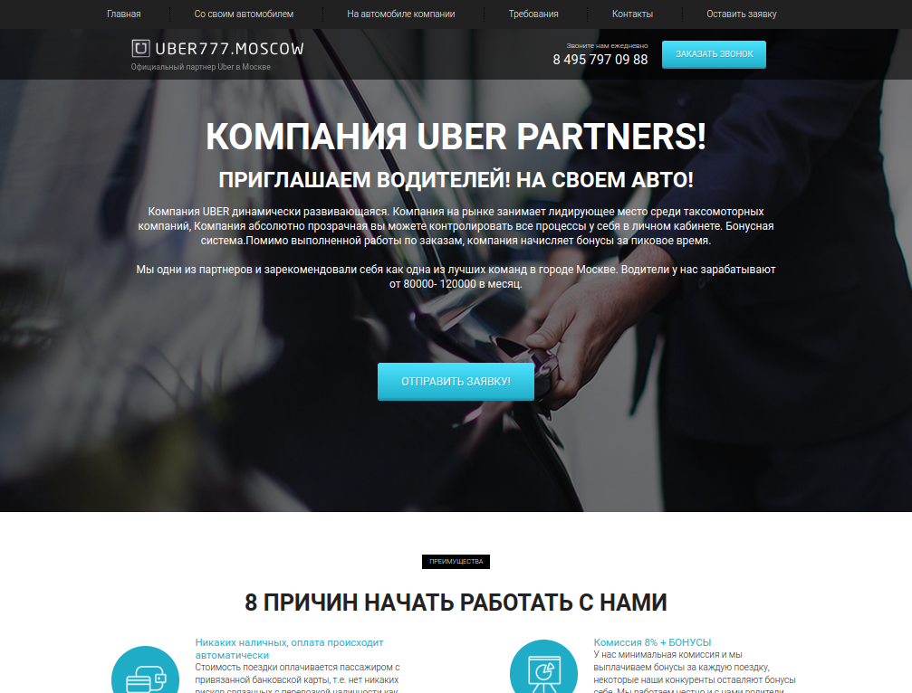

### UBER

---

## Задача из курса "WEB-разработчик 2021":

- Выполнить адаптивную верстку страницы по приложенному макету figma.
- Использовать фреймворк Bootstrap.
- Использовать препроцессор SASS.
- Использовать менеджер задач Gulp.
- С помощью JS запрограммировать кнопку "hamburger"(при нажатие появляется меню в мобильной версии).

---

## Инструменты:

     
---

 
Итоговый результат можно увидеть по данной <a href="https://brahner.github.io/Uber/">ссылке</a>
